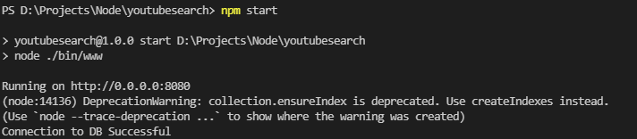

[![LinkedIn][linkedin-shield]][linkedin-url]

<!-- PROJECT LOGO -->
<br />
<p align="center">
  <a href="https://github.com/ajayaradhya/youtubesearch">
    
  </a>

  <h3 align="center">Youtube Latest Videos and Search App</h3>

  <p align="center">
    An app to see latest YouTube videos and Search using keywords.
  </p>
</p>

<!-- ABOUT THE PROJECT -->
## About The Project

This app lets you watch latest YouTube video for any topic.
It's search capability is so amazing that you just need to type in the videos you want to watch, we will ensure you get the videos you had in mind.

What it offers:
* See all data related to each YouTube video : Title, Description, Channel, Publish Date etc.
* Search across all the videos to find and we provide you the best video you need.
* Ensures the video library is upto date so that you don't feel outdated!

### Built With

Here are some of the frameworks I have used
* [NodeJS](https://nodejs.org/en/)
* [ExpressJS](https://expressjs.com/)
* [MongoDB](https://www.mongodb.com/)

<!-- GETTING STARTED -->
## Getting Started

Setting up the project is very simple. You need to run few commands.

### Prerequisites

Here are some of the softwares you need to run this project
* Latest npm from [NodeJS](https://nodejs.org/en/download/) website. If you have it installed, make sure you are on latest:
  ```sh
  npm install npm@latest -g
  ```
* Mongo DB Community Edition [[Windows Download](https://www.mongodb.com/try/download/community)]

### Installation

1. Get yourself a free YouTube API Key [Getting Started with YouTube Data APIs](https://developers.google.com/youtube/v3/getting-started)
2. Clone the repo
   ```sh
   git clone https://github.com/your_username_/Project-Name.git
   ```
3. Install NPM packages
   ```sh
   npm install
   ```

4. Follow `config.js.example` and create `config.js` from it. Replace the following items:
   * `ApiKey`: This is the key you created in Step 1
   * `SecondaryApiKey` (optional): You can have a backup key in case primary one gets exhausted.
   * `SearchString`: Topic you want to run the app in. Example: COVID, Cricket, Football.
   ```JS
   {
      ApiKey: "AIzaSy...",
      SecondaryApiKey: "SyAU2PP7...",
      SearchString: "COVID",
   }
   ```
   Note that the `SeachString` can contain multiple fields separated by `|` like `COVID | Coronavirus | Pandemic`

5. Run the application by using the following command:
   ```sh
   npm start
   ```

6. Application will start to run and will listen on port `8080` or whatever is configured in `config.js`




<!-- USAGE EXAMPLES -->
## Usage

Here are the two methods that the application offers
* `List Videos`: All the videos that are available are listed as a part of `search` api
  ```
  http://localhost:8080/videos/search?q=[searchstring]
  ```
  `searchstring` needs to be replaced with the string you want to search for.
  You can use space to separate the words.
  ```
  http://localhost:8080/videos/search?q=covid cases india
  ```

* `Search API`: This does search across all videos based on your search input
  ```
  http://localhost:8080/videos/show
  ```
  The output is *paginated* and hence the caller should make sure they pass the cnsequent page numbers to retrieve the next data.
  ```
  http://localhost:8080/videos/show?currentPage=2&pageSize=50
  ```
  This retrieves the next page's results with a total of 50 records max in this page.
  Response contains the following metadata in order to show if there are more results available.
  ```JS
  {"currentPage":1,"pageCount":4,"pageSize":50,"count":178}
  ```

<!-- LICENSE -->
## License

Distributed under the GNU License. See `LICENSE` for more information.

<!-- CONTACT -->
## Contact

Ajay B L - [linkedin](https://www.linkedin.com/in/ajay-bl/) - be.el.ajay@gmail.com

Project Link: [https://github.com/ajayaradhya/youtubesearch](https://github.com/ajayaradhya/youtubesearch)


[linkedin-shield]: https://img.shields.io/badge/-LinkedIn-black.svg?style=for-the-badge&logo=linkedin&colorB=555
[linkedin-url]: https://www.linkedin.com/in/ajay-bl/